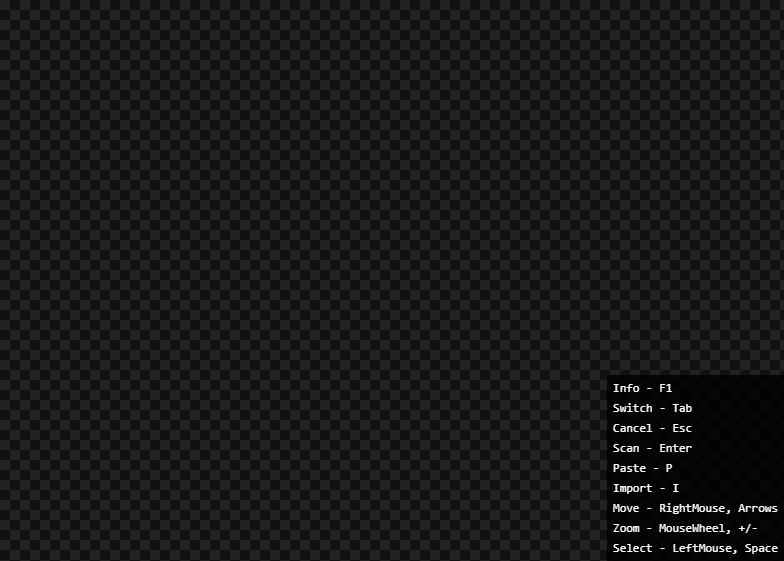

# PRTR (Project Reality Tesseract)

`Electron.js` app that quickly retrieves player info from the `Project Reality` video game. `Tesseract.js` library used for screenshot-to-text conversion to scrape player in-game time from the `PRstats` website.



## Usage
Go to the [releases](https://github.com/PD-22/prtr/releases) page and download the latest exe file installer.

Notice: Currently the [prstats](http://prstats.realitymod.com) website is unavailable so a mock data is used.

Global shortcuts | Description
-|-
<kbd>F1</kbd> | Toggle shortcuts reminder
<kbd>Tab</kbd> | Switch between canvas and terminal
<kbd>Escape</kbd> | Cancel loading actions
<kbd>F11</kbd> | Toggle Fullscreen

Canvas shortcuts | Description
-|-
<kbd>Escape</kbd> | Reset canvas selection
<kbd>Enter</kbd> | Read text from the displayed image and paste it to the terminal
<kbd>P</kbd> | Paste image from clipboard
<kbd>I</kbd> | Import image from files
<kbd>E</kbd> | Export image to a file
<kbd>C</kbd> | Crop image from selection
<kbd>RightMouse</kbd>, <kbd>↑ ↓ → ←</kbd> | Move the screen on the canvas
<kbd>MouseWheel</kbd>, <kbd>+</kbd>, <kbd>-</kbd> | Zoom in and out of the canvas
<kbd>0</kbd> | Reset zoom to 100%
<kbd>LeftMouse</kbd>, <kbd>Space</kbd> | Select rectangle (after <kbd>space</kbd> use <kbd>↑ ↓ → ←</kbd>)

Terminal shortcuts | Description
-|-
<kbd>Escape</kbd> | Deselect terminal text cancel all loading lines
<kbd>Enter</kbd> | Search player in-game times (cancel line by editing it)
<kbd>Ctrl</kbd>+<kbd>Delete</kbd> | Parse player names
<kbd>Ctrl</kbd>+<kbd>Z</kbd> | Undo history
<kbd>Ctrl</kbd>+<kbd>Y</kbd>, <kbd>Ctrl</kbd>+<kbd>Shift</kbd>+<kbd>Z</kbd> | Redo history
<kbd>Ctrl</kbd>+<kbd>↓</kbd> | Sort lines ascending
<kbd>Ctrl</kbd>+<kbd>↑</kbd> | Sort lines descending
<kbd>Alt</kbd>+<kbd>↑</kbd> | Move line up
<kbd>Alt</kbd>+<kbd>↓</kbd> | Move line down

## Development
```
git clone https://github.com/PD-22/prtr.git
cd prtr
npm install
npm run start
```